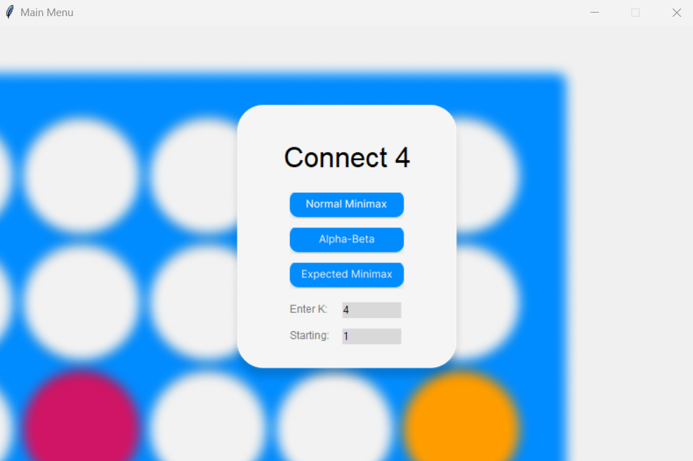
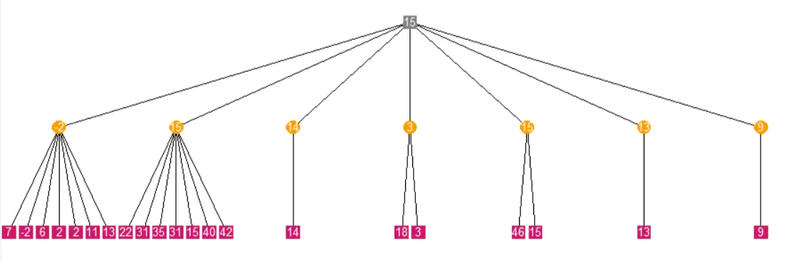

# Connect 4 AI

## Overview

This project implements a Connect 4 game with an AI player that can be configured to use different decision-making strategies. The game is designed with several algorithms for AI play, including **Minimax**, **Pruning Minimax** (with Alpha-Beta Pruning), and **Expected Minimax**. Additionally, it visualizes the Minimax decision tree for a more interactive and educational experience.

## Features

- **Two-player game** (Human vs AI).
- **AI modes:**
    - **Minimax**: Standard decision-making where the AI maximizes its score and minimizes the opponent’s score.
    - **Pruning Minimax (Alpha-Beta Pruning)**: Optimized version of Minimax to reduce the search space.
    - **Expected Minimax**: Handles probabilistic outcomes for games with chance events.
    - **Interactive game board** with easy-to-use mechanics.
    - **Visualization**: The Minimax tree is visualized using Tkinter, which provides an interactive graphical representation of the decision-making process.

## How to Play

1. The game is played on a **7x6 board**.
2. Players take turns dropping their colored discs into the columns.
3. The player with the maximum aligned **4 discs** horizontally, vertically, or diagonally wins.
4. The AI can be configured with different strategies, including Minimax or Expected Minimax, with varying difficulty levels.

## Setup and Installation

1. Clone the Repository
    
    ```bash
    git clone <repository_url>
    cd <repository_name>
    ```
    
2. Install Tkinter (if it's not already installed with Python)
    - On **Ubuntu/Debian**:
        
        ```bash
        sudo apt-get install python3-tk
        ```
        
    - On **macOS** and **Windows**, Tkinter is usually bundled with Python, so no installation is required.
3. Run the Game
    
    ```bash
    python main.py
    ```
    

## Graphical User Interface (GUI)






*Zoom in and out is available in tree visualization

## Sample Runs and Their Corresponding Minimax Trees

1. minimax (k = 2)


1. minimax with alpha-beta pruning (k = 4)


*The tree is traceable, using zoom in and out and scroll bars 

1. Expected Minimax 


*Zoom in - example

## Comparison Between Minimax Pruning & Expected Minimax

*total nodes: the number of nodes has been expanded during the whole game (about 21 moves for AI agent)

*k: depth

**Minimax Pruning**

| k | Total Nodes Expanded in The Game  | Total Time Taken by Ai agent (sec) | Avg. Time for Move (sec) |
| --- | --- | --- | --- |
| 3 | 2861 | 0.8240 | 0.0392 |
| 4 | 9542 | 2.7751 | 0.1321 |
| 5 | 19612 | 5.7747 | 0.2749 |
| 6 | 98981 | 29.273 | 1.3939 |
| 7 | 320750 | 96.30 | 4.58 |
| 8 | 764750 | 233.76 | 11.13 |

Expected Minimax

| k | Total Nodes Expanded in The Game | Total Time Taken by Ai agent (sec) | Avg. Time for One Move (sec) |
| --- | --- | --- | --- |
| 3 | 2539 | 0.6684 | 0.0318 |
| 4 | 2334 | 0.6246 | 0.0297 |
| 5 | 18540 | 4.616 |  0.219 |
| 6 | 19781 | 4.99 | 0.237 |
| 7 | 67089 | 16.57 |  0.78 |
| 8 | 78496 | 19.93 | 0.94 |

game statistics for minimax pruning (k = 8)


game statistics for expected minimax (k = 8)


Player 1: AI agent, Player2: Human

## Performance Optimization

### Performance Optimization with Backtracking:

- **Purpose**: Allows the algorithm to simulate potential moves and then "undo" them, efficiently exploring all possible game states without copying the board many times.
- **Optimization Benefit**: Saves memory and computational resources by reusing the same board object rather than creating a new one for each state
- **In Code**:
    - `add_piece` applies a move to explore a branch of the game tree.
    - `remove_piece` reverts the move, restoring the board to its previous state.

### **Performance Optimization with Memoization**

- **Purpose**: Avoids redundant calculations by storing previously evaluated board states (game tree nodes) in a cache.
- **Optimization Benefit**:
    - **Speeds up repeated evaluations**: If a game state is reached multiple times, its precomputed result is reused.
    - **Reduces computational complexity**: Prevents recalculating heuristic scores for identical board states, especially in deeper levels of the game tree.

---

**Contributors:**

Abdelrhman Deif 

Ahmed Hassan  

Mohamed Nasr
